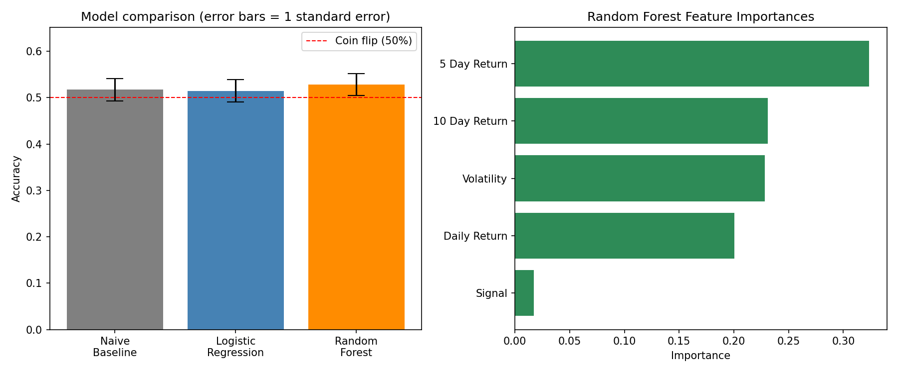

# Next-Day Return Direction Classifier

A supervised classification project that predicts whether a single stock's next day return will be positive or negative using its price history, evaluated against a naive baseline with a time-respecting train/test split.

## Methodology

1. **Data** — daily adjusted close prices for a single ticker via `yfinance`.
2. **Feature engineering** — lagged/cumulative returns (1, 5, and 10-day), 10-day rolling volatility, and a moving-average-crossover signal (10-day MA vs. 50-day MA).
3. **Label** — 1 if the next day's return is positive, else 0. Built by shifting the return series *backward* one day and handling the edge case where the shifted value is undefined (see Limitations).
4. **Split** — time-based, not shuffled. Training on the earlier portion of the data and testing on the later portion, since shuffling would let the model train on information from after the days it's being tested on.
5. **Models** — a naive majority-class baseline, logistic regression (with feature scaling), and a random forest (unscaled features, depth-capped).
6. **Evaluation** — accuracy, full classification report (precision/recall/F1), confusion matrix, and feature importances (random forest).

## Results

- Ticker / date range: **[AAPL / 2010-01-01 – 2019-01-01]**
- Naive baseline accuracy: **[0.5169]**
- Logistic regression accuracy: **[0.5147]**
- Random forest accuracy: **[0.5282]**
- Top features by importance (random forest): **[5 Day Return (0.323486), 10 Day Return (0.230956), Volatility (0.228137), Daily Return (0.200345), Signal (0.017075)]**



The left panel compares all three models' accuracy with error bars showing one standard error, against a dashed line marking the 50% coin-flip baseline — this is the visual version of the statistical significance finding below: the bars and their error ranges overlap each other and the coin-flip line, which is the honest picture, not a hidden caveat. The right panel shows which engineered features the random forest relied on most.

## How to run

```
pip install -r requirements.txt
python3 return_classifier.py
```
Enter a ticker and a date range when prompted. Prints accuracy, a classification report, and a confusion matrix for the naive baseline, logistic regression, and random forest in turn, plus feature importances for the random forest, and saves a two-panel results chart (`classifier_results.png`) comparing model accuracy (with standard error) and feature importances.

## Testing

```
pytest test_return_classifier.py -v
```
Covers `compute_features`, `finalize_features`, `split_features_and_labels`, and `naive_baseline` against hand-derived expected values on a small synthetic price series. `fetch_price_data`, `logistic_regression`, and `random_forest` are not unit tested directly — the first is a thin network-I/O wrapper, and the latter two wrap sklearn's model-fitting machinery and depend on real data rather than something worth fabricating a synthetic dataset for. 

## Limitations

- **The random forest's edge over the naive baseline is not statistically significant.** The accuracy gap (roughly 1 percentage point) is smaller than the estimated standard error of the accuracy measurement (roughly 2.4 percentage points, from `sqrt(p(1-p)/n)` on a few hundred test days). This is consistent with there being no real difference in performance — the result does not provide strong evidence that either model beats blind majority-class guessing on this data.
- **Daily direction prediction is inherently close to a coin flip.** This is a well-known property of the problem itself, and the results here should be read in that light, not as evidence of a working trading signal.
- **`max_depth=5` on the random forest was a deliberate choice**, not sklearn's default (unbounded depth), made to reduce overfitting risk given roughly 1,700 training rows and only 5 features. Not exhaustively tuned against alternatives.
- **Single ticker, single date range.** No cross-validation across multiple stocks or time periods, so these results may not generalize even to the same ticker in a different window.
- **Not a trading strategy.** No transaction costs, slippage, or position sizing — this is a classification exercise evaluated on accuracy, not a backtested strategy evaluated on returns (that's what the companion stat arb project does instead).
- A `RuntimeWarning` (overflow/divide-by-zero) occasionally appears during logistic regression fitting. Investigated directly: the model's final coefficients and predicted probabilities contain no `NaN`/`inf` values, so this does not appear to corrupt the reported results — but the root cause (possibly related to the local Python/numpy environment) wasn't fully resolved given project time constraints.

## Stack

Python, pandas, numpy, scikit-learn, yfinance, matplotlib, pytest